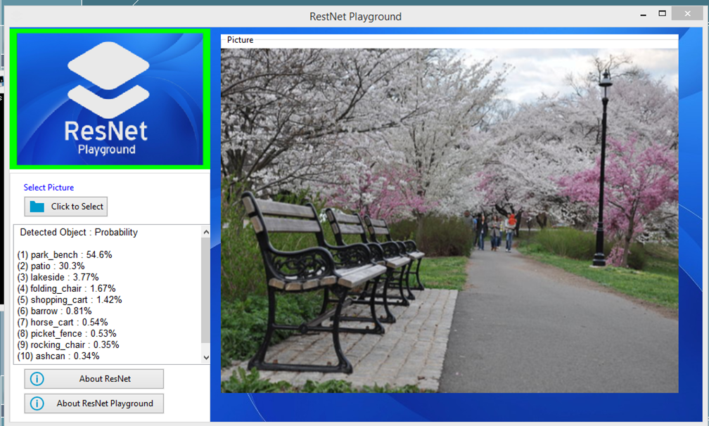
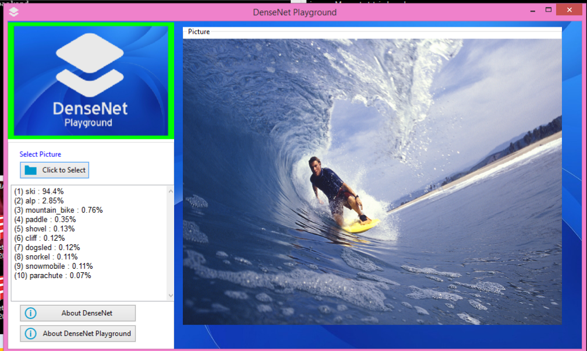
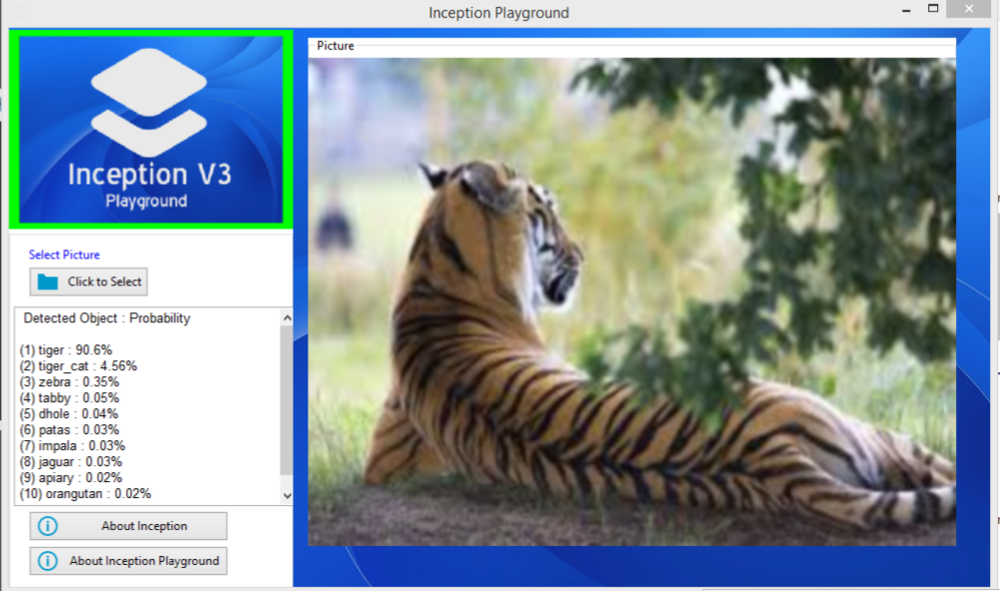

 
<h1 style="font-family: Calibri;" ><b> &nbsp &nbsp &nbsp &nbsp &nbsp Machine Learning Model Playgrounds </b></h1>

 

 
 &nbsp &nbsp &nbsp &nbsp The <b> Machine Learning Model Playgrounds</b> is a project that is part of the dream of
         a team of Moses Olafenwa and John Olafenwa to bring current capabilities in machine learning and artificial intelligence into practical 
        use for non-programmers and average computer users. This project is the first step in what we hope will become
        mainstream application in modern technology in which Computers, Smartphones, Edge Devices and Systems will 
        have in-built state-of-the-art Machine Learning and Artificial Intelligence capabilities without having to
        connect to cloud based services.  
        &nbsp &nbsp &nbsp &nbsp The <b>Machine Learning Model Playgrounds </b> is a series of Windows programs built using pure 
        python libraries and code. Each of the programs is a user-friendly demo of Image Classification powered by
        a specific image classification model of popular Machine Learning Algorithms trained on the ImageNet (1000 object classes )
        dataset. Each program provides a user interface where users can select a picture from their Windows system folder
        while the program process the selected picture and give top-10 possible results of the objects detected with
        percentage probability per each result.   
        &nbsp &nbsp &nbsp &nbsp &nbsp This repository contains the source code, models and builds of each of the programs in the
        <b>Model Playgrounds </b> series. It is provided to allow other developers outside our team to adapt, modify or extend
         the code to produce more programs that may be specific to a social, business, economic or scientific need.    
         &nbsp &nbsp &nbsp &nbsp The dependencies used for this project are listed below:  
         &nbsp &nbsp  <b>- Python 3.5.2</b>  
         &nbsp &nbsp  <b>- Tensorflow 1.4.0</b>  
         &nbsp &nbsp  <b>- Keras 2.0.8</b>  
         &nbsp &nbsp  <b>- Numpy 1.13.1</b>  
         &nbsp &nbsp  <b>- Scipy 0.19.1</b>  
         &nbsp &nbsp  <b>- wxPython 4.0.0</b>    
          Below you will find the details and pictures of each of the programs in the series.
    
  <h2 style="font-family: Calibri;" ><b> >> ResNet Playground</b></h2>
           
          
            
 
              &nbsp &nbsp &nbsp &nbsp &nbsp The <b>ResNet Playground</b> is powered by the ResNet50 model trained
              on the ImageNet dataset. You can find its source codes in the <i>resnet-playground</i> folder
               of this repository or follow this <a href="https://github.com/OlafenwaMoses/Model-Playgrounds/tree/master/resnet-playground" >link</a>. You can also download the Windows Installer
                for the program in the Release section of this project or follow this <a href="https://github.com/OlafenwaMoses/Model-Playgrounds/releases/download/v1.0/ResNet.Playground.1.0.exe" >link</a>. 
                &nbsp &nbsp &nbsp &nbsp &nbsp This program is a Windows 64-bit software that can be installed on
                Windows 7 and later versions of the Operating System. It has an installer size of 227mb and install
                 size of 690mb. The program was compiled using PyInstaller 3.3 for Python 3.5 . 
          
  <h2 style="font-family: Calibri;" ><b>>> DenseNet Playground</b></h2>
           
          
           
 
              &nbsp &nbsp &nbsp &nbsp &nbsp The <b>DenseNet Playground</b> is powered by the DenseNet121 model trained
              on the ImageNet dataset. You can find its source codes in the <i>densenet-playground</i> folder
               of this repository or follow this <a href="https://github.com/OlafenwaMoses/Model-Playgrounds/tree/master/densenet-playground" >link</a>. You can also download the Windows Installer
                for the program in the Release section of this project or follow this <a href="https://github.com/OlafenwaMoses/Model-Playgrounds/releases/download/v1.0/DenseNet.Playground.1.0.exe" >link</a>. 
                &nbsp &nbsp &nbsp &nbsp &nbsp This program is a Windows 64-bit software that can be installed on
                Windows 7 and later versions of the Operating System. It has an installer size of 166mb and install
                 size of 623mb. The program was compiled using PyInstaller 3.3 for Python 3.5 . 
          
  <h2 style="font-family: Calibri;" ><b>>> SqueezeNet Playground</b></h2>
           
          
           
 
              &nbsp &nbsp &nbsp &nbsp &nbsp The <b>SqueezeNet Playground</b> is powered by the SqueezeNet model trained
              on the ImageNet dataset. You can find its source codes in the <i>squeezenet-playground</i> folder
               of this repository or follow this <a href="https://github.com/OlafenwaMoses/Model-Playgrounds/tree/master/squeezenet-playground" >link</a>. You can also download the Windows Installer
                for the program in the Release section of this project or follow this <a href="https://github.com/OlafenwaMoses/Model-Playgrounds/releases/download/v1.0/SqueezeNet.Playground.1.0.exe" >link</a>. 
                &nbsp &nbsp &nbsp &nbsp &nbsp This program is a Windows 64-bit software that can be installed on
                Windows 7 and later versions of the Operating System. It has an installer size of 142mb and install
                 size of 596mb. The program was compiled using PyInstaller 3.3 for Python 3.5 . 
          
   <h2 style="font-family: Calibri;" ><b>>> Inception Playground</b></h2>
           
          
            
 
              &nbsp &nbsp &nbsp &nbsp &nbsp The <b>Inception Playground</b> is powered by the Inception V3 model trained
              on the ImageNet dataset. You can find its source codes in the <i>inception-playground</i> folder
               of this repository or follow this <a href="https://github.com/OlafenwaMoses/Model-Playgrounds/tree/master/inception-playground" >link</a>. You can also download the Windows Installer
                for the program in the Release section of this project or follow this <a href="https://github.com/OlafenwaMoses/Model-Playgrounds/releases/download/v1.0/Inception.Playground.1.0.exe" >link</a>. 
                &nbsp &nbsp &nbsp &nbsp &nbsp This program is a Windows 64-bit software that can be installed on
                Windows 7 and later versions of the Operating System. It has an installer size of 221mb and install
                 size of 686mb. The program was compiled using PyInstaller 3.3 for Python 3.5 . 
          
    &nbsp &nbsp &nbsp &nbsp &nbsp We are open to comments, suggestions and questions on this project. Feel free
           to reach to our team via our contact below:    &nbsp &nbsp <b>- Moses Olafenwa</b>, Chief Programmer of the Playground project   &nbsp &nbsp  &nbsp <b> Email: </b> <a href="mailto:guymodscientist@gamil.com" > guymodscientist@gmail.com </a>  
            &nbsp &nbsp  &nbsp <b> Twitter: </b> <a target="_blank" href="https://www.twitter.com/OlafenwaMoses" > @OlafenwaMoses </a>    &nbsp &nbsp <b>- John Olafenwa</b>, Technical Adviser of the Playground project  
            &nbsp &nbsp  &nbsp <b> Email: </b> <a href="mailto:johnolafenwa@gamil.com" > johnolafenwa@gmail.com </a>  
            &nbsp &nbsp  &nbsp <b> Twitter: </b> <a target="_blank" href="https://www.twitter.com/johnolafenwa" > @johnolafenwa </a>

